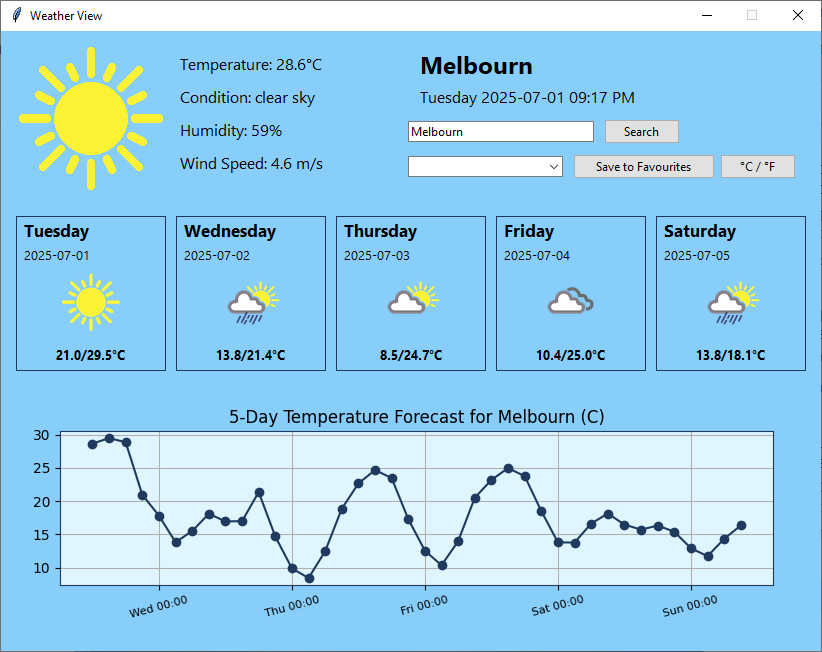
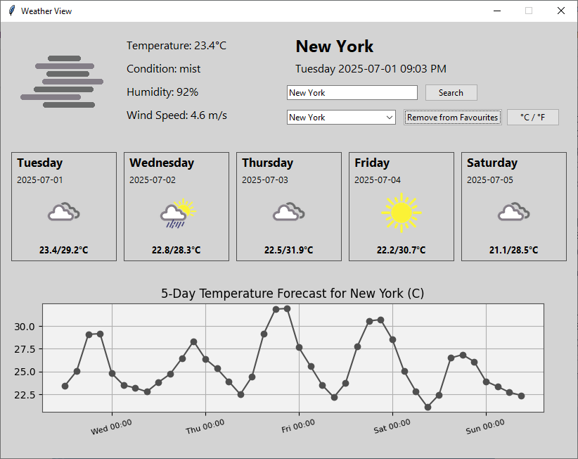

A GUI weather app built with Tkinter and geopy. Displays current weather, 5-day forecast, and includes location-based weather fetching.

## Features
- Search by city
- Current weather + 5-day forecast
- Temperature unit toggle (C/F)
- Weather-based themes
- Location-based auto-fetching

# 🌦️ Weather View

A sleek, interactive desktop weather dashboard built with **Python**, **Tkinter**, and the **OpenWeatherMap API**. Displays current weather, a 5-day forecast with icons, and dynamically changes background themes based on weather conditions. Includes geolocation, temperature charting, and favourite city support. Built as a personal portfolio project.

---

## 📸 Screenshots

<p align="center">
  
  &nbsp;&nbsp;&nbsp;&nbsp;
  
</p>

---

## ✨ Features

- 🔍 Search by city name
- 📍 Location-based weather using geopy
- 🌡️ Toggle between Celsius and Fahrenheit
- 📅 5-day forecast with dynamic icons
- 🎨 Weather-based theme backgrounds
- ❤️ Save & load favourite cities
- 📊 Forecast temperature chart (via Matplotlib)
- 🔄 Auto-refreshes every 15 minutes

---

## 🚀 Getting Started

These instructions will help developers set up and run the app locally from source.

### 1. Clone the repository

```bash
git clone https://github.com/heaD-tWin/WeatherView.git
cd WeatherView
```

### 2. Create and activate a virtual environment, then install dependencies.

```bash
python -m venv venv
```

- On Windows:

```bash
venv\Scripts\activate
```

- On macOS/Linux:

```bash
source venv/bin/activate
```

### 3. Install dependencies

```bash
pip install -r requirements.txt
```

### 4. Add your API key and email

Create a `.env` file in the root directory (same folder as `Main.py`) with the following content:

```env
OPENWEATHER_API_KEY=your_api_key_here
GEOPY_USER_AGENT_EMAIL=your_email_here
```

You can use the included `.env.example` file as a template.

> **Note:** Your API key and email are only used to access OpenWeatherMap and geopy services. They are not stored, logged, or shared.

### Running the App

Once the `.env` file is configured, start the app by running:

```bash
python Main.py
```

### Optional: Build as Standalone .exe

If you'd like to export the project as a single-file executable (for personal or demo use):

```bash
pyinstaller --clean --onefile --noconsole --add-data "weather_icons;weather_icons" Main.py
```

⚠️ When running the `.exe`, you must place your `.env` file in the same folder as the `.exe` or it won’t be able to access your API credentials.

---

## 🧪 Testing

This project includes a comprehensive test suite built with **pytest**. The tests use mocking to ensure that application logic can be verified without making live network calls.

To run the tests, execute the following command from the project's root directory:

```bash
pytest tests/
```

All 33 tests should pass, confirming that the application's core logic, API handling, and utility functions are working as expected.

---

## 📁 Project Structure

```
WeatherView/ 
├── main.py                 # Main application entry point 
├── weather_api.py          # Handles calls to the OpenWeatherMap API 
├── geolocation.py          # Determines user's city via IP address 
├── ui_components.py        # Builds and manages all UI elements 
├── graph_forecast.py       # Creates the Matplotlib forecast graph 
├── favourites.py           # Manages saving/loading of favourite cities 
├── themes.py               # Manages dynamic background colors 
├── utils.py                # Utility functions for UI interaction 
├── logger.py               # Configures application-wide logging 
│ ├── screenshots/          # Screenshots
│   └── ... 
│ ├── tests/ 
│   ├── test_favourites.py 
│   ├── test_main.py 
│   ├── test_ui_components.py 
│   ├── test_utils.py 
│   └── test_weather_api.py 
│ ├── weather_icons/        # Weather icon image assets 
│ ├── favourites.json       # Saved city list (ignored by Git) 
├── requirements.txt        # Project dependencies 
├── .env.example            # Template for environment variables 
├── README.md               # This file 
└── .gitignore              # Specifies files to be ignored by Git
```

---

## 🙅 Files Ignored from GitHub

- `.env` — contains private API key and email  
- `favourites.json` — user-saved city data  
- Any exported `.exe` files — not suitable for source control

---

## 👨‍💻 Author

Dan White  
Australia-based Python and UI developer  
Email: danwhite1984@live.com.au

---

## 📄 License

This project is licensed under the **MIT License** — see the [LICENSE](LICENSE) file for details.


